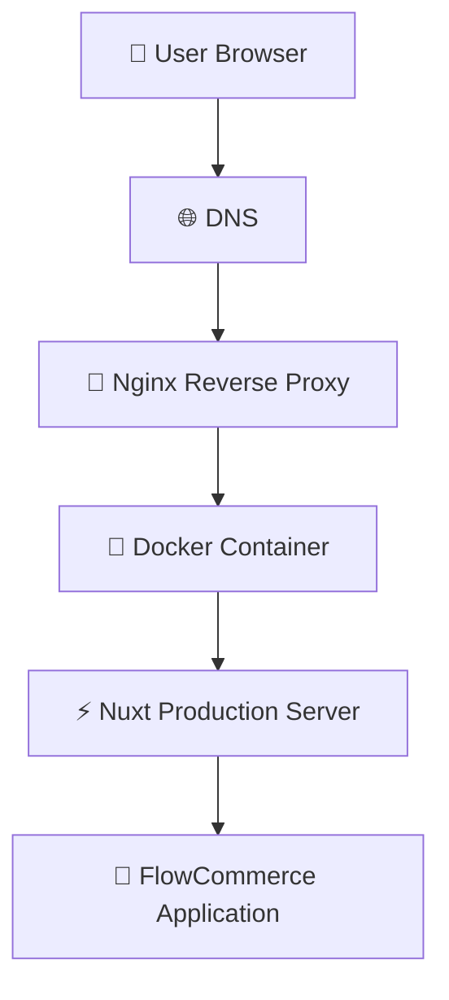
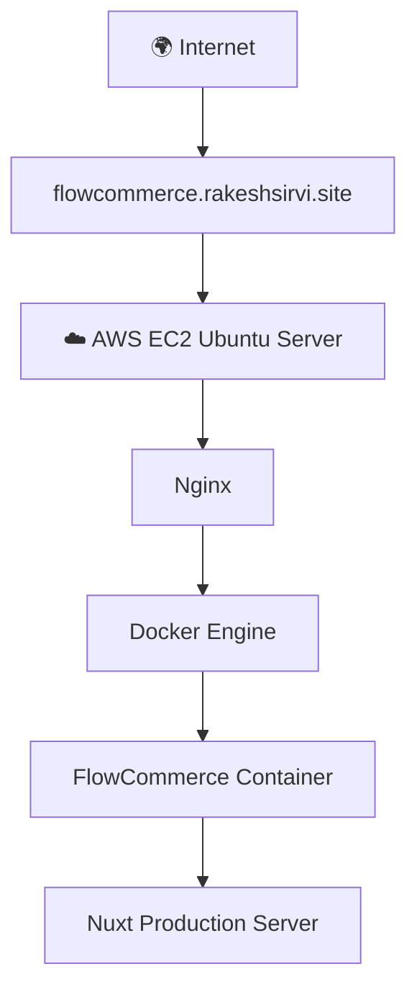
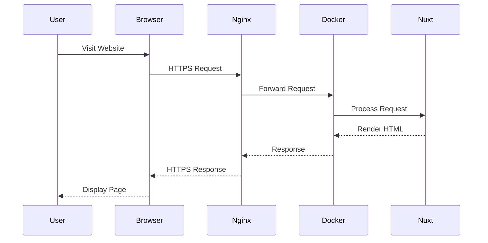
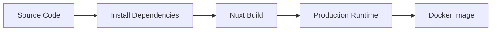
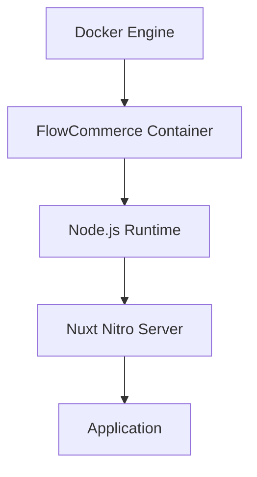
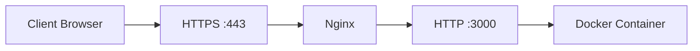
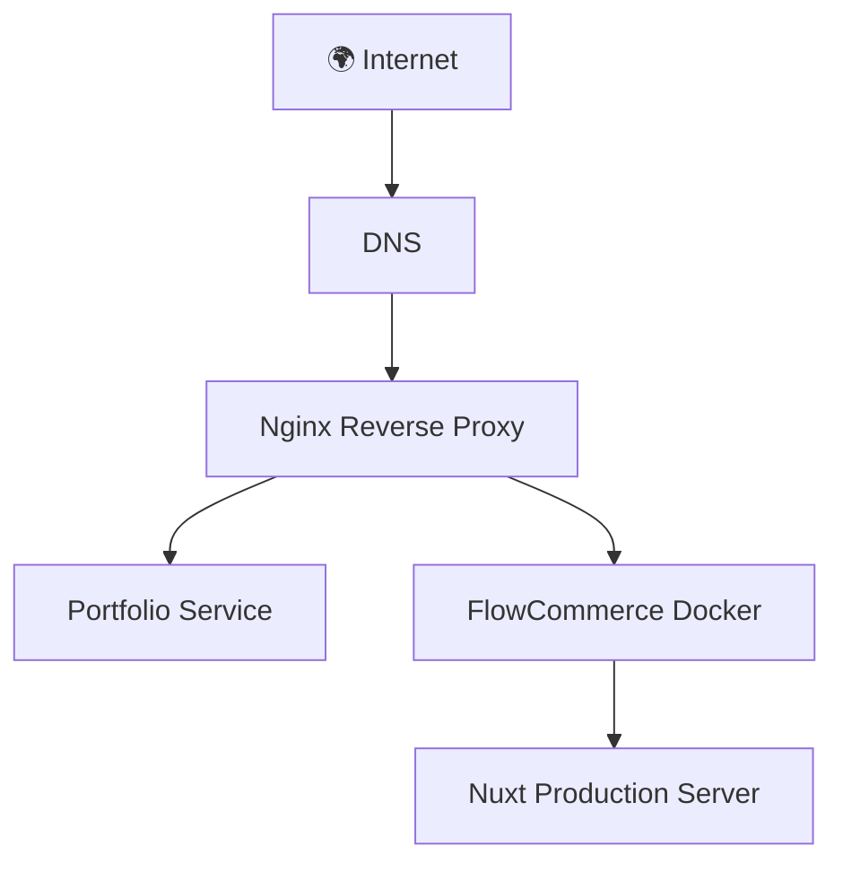

<div align="center">

# 🛒 FlowCommerce

### A Modern Cloud-Native E-Commerce Platform Built with Nuxt, Docker & AWS

Production-ready e-commerce application demonstrating modern full-stack development, containerization, cloud deployment, reverse proxy configuration, and scalable infrastructure.

---

[](https://nuxt.com/)
[](https://nodejs.org/)
[](https://www.docker.com/)
[](https://aws.amazon.com/ec2/)
[](https://nginx.org/)
[](https://letsencrypt.org/)
[](LICENSE)

</div>

---

## 📖 Overview

FlowCommerce is a production-ready e-commerce platform designed to demonstrate modern web development and DevOps best practices.

The project combines a high-performance Nuxt application with Docker containerization, Nginx reverse proxy, HTTPS via Let's Encrypt, and deployment on AWS EC2. It is structured to be scalable, maintainable, and cloud-ready while serving as a real-world example of deploying containerized applications in production.

Whether you're exploring modern deployment strategies, learning Docker, or building scalable web applications, FlowCommerce provides a practical reference implementation.

---

## ✨ Highlights

- ⚡ Nuxt 3 Production Build
- 🐳 Multi-Stage Docker Build
- ☁️ AWS EC2 Deployment
- 🔒 HTTPS with Let's Encrypt SSL
- 🌐 Nginx Reverse Proxy
- 🚀 Production Ready
- 📱 Responsive Design
- 🔄 Docker Compose Support
- 🛡️ Secure Deployment
- 📦 Lightweight Container Image

---

## 🚀 Live Demo

> **Website:** https://flowcommerce.rakeshsirvi.site

---

## 📚 Table of Contents

- Overview
- Features
- Screenshots
- Tech Stack
- Architecture
- Project Structure
- Installation
- Docker
- Docker Compose
- AWS Deployment
- Nginx Configuration
- SSL Setup
- CI/CD
- Security
- Performance
- Roadmap
- Troubleshooting
- License

# 🌟 About FlowCommerce

FlowCommerce is a modern, cloud-native e-commerce platform developed to demonstrate industry-standard full-stack development and DevOps deployment practices. The project combines a performant Nuxt 3 frontend with containerized deployment using Docker, reverse proxy management through Nginx, and secure HTTPS hosting on AWS EC2.

Unlike a basic shopping application, FlowCommerce focuses on production readiness. Every component of the project—from the Docker image to the deployment architecture—has been designed to reflect real-world deployment patterns used in modern software engineering.

The application showcases how a scalable web application can be packaged, deployed, secured, and managed in a Linux server environment while remaining easy to maintain and extend.

---

## 🎯 Objectives

The primary objectives of FlowCommerce are:

- Build a modern and responsive e-commerce application.
- Demonstrate production-ready Docker containerization.
- Deploy the application on a cloud-based Linux server.
- Configure Nginx as a reverse proxy.
- Secure the application using HTTPS with Let's Encrypt.
- Provide a clean and maintainable project structure.
- Follow industry-standard deployment workflows.
- Create a portfolio-quality project that reflects real-world engineering practices.

---

## 🚀 Why FlowCommerce?

Many tutorial projects focus only on application development. FlowCommerce goes beyond development by demonstrating the complete lifecycle of deploying a production application.

This project includes:

- Application Development
- Production Builds
- Docker Containerization
- Reverse Proxy Configuration
- SSL Certificate Management
- Cloud Deployment
- Linux Server Administration
- Production Networking
- Scalable Infrastructure

These are the same concepts commonly used when deploying applications in startup and enterprise environments.

---

## 💡 Key Capabilities

### 🛍️ Modern Shopping Experience

The application provides a clean, responsive, and user-friendly interface for browsing products and navigating an e-commerce platform.

### 🐳 Containerized Deployment

The entire application is packaged inside a Docker container, ensuring consistent behavior across development, testing, and production environments.

### ☁️ Cloud Deployment

FlowCommerce is deployed on an AWS EC2 Ubuntu server, making it accessible from anywhere while following modern cloud deployment practices.

### 🌐 Reverse Proxy Architecture

Nginx routes incoming HTTPS requests to the Docker container, enabling multiple applications to run securely on a single server.

### 🔒 Secure by Default

HTTPS is enabled using Let's Encrypt SSL certificates, ensuring encrypted communication between users and the application.

### 📈 Scalable Foundation

The deployment architecture is designed so additional services or applications can be hosted alongside FlowCommerce without significant changes to the infrastructure.

---

## 🎓 Learning Outcomes

Building FlowCommerce demonstrates practical knowledge of:

- Modern JavaScript application deployment
- Docker image creation
- Multi-stage Docker builds
- Linux server administration
- Nginx configuration
- Reverse proxy concepts
- Domain configuration
- HTTPS certificate management
- Cloud deployment on AWS
- Production application hosting
- Docker Compose orchestration
- Git-based deployment workflows

---

## 🎯 Target Audience

FlowCommerce serves as a reference project for:

- Students learning full-stack development
- Developers exploring Docker and cloud deployment
- DevOps engineers practicing containerized deployments
- Recruiters evaluating production-ready projects
- Organizations looking for a modern deployment reference

# ✨ Features

FlowCommerce is designed with a focus on usability, scalability, and production readiness. The application combines a modern shopping experience with cloud-native deployment practices.

---

## 🛍️ Customer Experience

| Feature | Description |
|----------|-------------|
| 🏪 Product Catalog | Browse products through a clean and responsive interface. |
| 🔍 Product Discovery | Easily explore available products with intuitive navigation. |
| 📱 Responsive Design | Optimized for desktop, tablet, and mobile devices. |
| ⚡ Fast Navigation | Smooth page transitions powered by Nuxt 3. |
| 🎨 Modern UI | Minimal, responsive, and user-friendly interface. |
| 🌐 SEO Friendly | Server-side rendering improves search engine visibility. |

---

## ⚙️ Application Features

| Feature | Description |
|----------|-------------|
| 🚀 Nuxt 3 Framework | Built using the latest Nuxt framework. |
| ⚡ Server Side Rendering | Faster initial page load and improved SEO. |
| 📦 Production Build | Optimized application bundle for deployment. |
| 🔄 Component-Based Architecture | Modular and reusable Vue components. |
| 🧩 Scalable Folder Structure | Organized project layout for easier maintenance. |

---

## 🐳 DevOps Features

| Feature | Description |
|----------|-------------|
| 🐳 Dockerized Application | Entire application runs inside a Docker container. |
| 📦 Multi-Stage Docker Build | Smaller, faster, and production-ready Docker images. |
| 🔄 Docker Compose | Simplified deployment and container management. |
| 🔒 Production Dependencies | Runtime image contains only required packages. |
| ♻️ Container Restart Policy | Automatic restart after server reboot or failures. |

---

## ☁️ Cloud Deployment

| Feature | Description |
|----------|-------------|
| ☁️ AWS EC2 Hosting | Hosted on an Ubuntu EC2 instance. |
| 🌐 Custom Domain | Accessible through a dedicated subdomain. |
| 🔒 HTTPS Enabled | Secured using Let's Encrypt SSL certificates. |
| 🔀 Reverse Proxy | Nginx forwards HTTPS traffic to the application container. |
| 📡 Public Deployment | Accessible from anywhere over the internet. |

---

## 🛡️ Security

| Feature | Description |
|----------|-------------|
| 🔐 HTTPS Encryption | Secure communication using SSL/TLS. |
| 🌍 Reverse Proxy Isolation | Backend remains protected behind Nginx. |
| 📦 Lightweight Runtime Image | Reduced attack surface with Alpine Linux. |
| 🚫 Development Dependencies Removed | Only production packages are shipped. |
| 🔄 Automatic SSL Renewal | Supports automated certificate renewal using Certbot. |

---

## 📈 Performance Optimizations

| Feature | Description |
|----------|-------------|
| ⚡ Multi-Stage Builds | Smaller Docker image size. |
| 📦 Alpine Linux | Lightweight production environment. |
| 🚀 Optimized Nuxt Build | Faster startup and reduced resource usage. |
| 💾 Cached Docker Layers | Faster rebuilds during development. |
| 📉 Reduced Image Size | Lower deployment time and bandwidth usage. |

---

## 🏗️ Infrastructure Highlights

- ✅ Production-ready Docker image
- ✅ Cloud deployment on AWS EC2
- ✅ HTTPS using Let's Encrypt
- ✅ Nginx Reverse Proxy
- ✅ Docker Compose support
- ✅ Linux-based production hosting
- ✅ Cloud-native deployment workflow
- ✅ Easy horizontal scalability
- ✅ Professional project structure
- ✅ Ready for CI/CD integration

---

## 📌 At a Glance

| Category | Status |
|----------|:------:|
| Production Ready | ✅ |
| Docker Support | ✅ |
| Docker Compose | ✅ |
| AWS Deployment | ✅ |
| HTTPS Enabled | ✅ |
| Reverse Proxy | ✅ |
| Responsive Design | ✅ |
| Cloud Ready | ✅ |
| CI/CD Ready | ✅ |
| Open Source Friendly | ✅ |

# 📸 Screenshots

A visual walkthrough of FlowCommerce showcasing the user interface, responsive design, and production deployment.

> **Note:** Replace the placeholder images below with actual screenshots from the application.

---

## 🏠 Home Page

The landing page introduces users to the platform with a modern interface, featured products, promotional banners, and intuitive navigation.

<p align="center">
    
</p>

---

## 🛍️ Product Catalog

Browse products through a responsive grid layout with organized categories and product cards.

<p align="center">
    
</p>

---

## 📦 Product Details

Each product page provides detailed information, pricing, images, and purchasing options.

<p align="center">
    
</p>

---

## 🛒 Shopping Cart

Customers can review selected items, update quantities, and proceed to checkout.

<p align="center">
    
</p>

---

## 💳 Checkout

A streamlined checkout experience designed for simplicity and ease of use.

<p align="center">
    
</p>

---

## 📱 Responsive Design

FlowCommerce is fully responsive and optimized for desktop, tablet, and mobile devices.

| Desktop | Tablet | Mobile |
|----------|---------|--------|
|  |  |  |

---

# 🐳 Docker Deployment

The application is packaged inside a production-ready Docker container using a multi-stage build for optimized image size and faster deployments.

<p align="center">
    
</p>

---

# ☁️ AWS Production Deployment

FlowCommerce is deployed on an Ubuntu AWS EC2 instance behind an Nginx reverse proxy with HTTPS enabled through Let's Encrypt.

<p align="center">
    
</p>

---

# 🎥 Live Demo

### 🌐 Website

> **https://flowcommerce.rakeshsirvi.site**

---

# 📹 Demo Video *(Optional)*

If available, include a short walkthrough demonstrating:

- Application overview
- Product browsing
- Responsive design
- Shopping workflow
- Docker deployment
- AWS hosting

Example:

```text
https://youtu.be/your-demo-video
```

# 🛠️ Technology Stack

FlowCommerce leverages modern web technologies and cloud-native tools to deliver a scalable, maintainable, and production-ready e-commerce platform.

---

# Frontend

The frontend is built using the latest Nuxt ecosystem, providing server-side rendering, improved SEO, and excellent performance.

| Technology | Purpose |
|------------|---------|
| **Nuxt 3** | Full-stack Vue framework for building modern web applications |
| **Vue 3** | Progressive JavaScript framework powering the UI |
| **TypeScript** | Static typing for improved reliability and maintainability |
| **HTML5** | Semantic page structure |
| **CSS3** | Responsive layouts and modern styling |
| **JavaScript (ES2023)** | Client-side functionality |

---

# Backend

The backend is powered by the Nitro server included with Nuxt.

| Technology | Purpose |
|------------|---------|
| **Node.js 20** | JavaScript runtime environment |
| **Nitro Server** | High-performance production server for Nuxt |
| **npm** | Dependency management and build tooling |

---

# DevOps & Infrastructure

The deployment architecture follows modern DevOps practices using containerization and reverse proxy configuration.

| Technology | Purpose |
|------------|---------|
| **Docker** | Containerization platform |
| **Docker Compose** | Multi-container orchestration |
| **Multi-Stage Docker Builds** | Smaller, optimized production images |
| **Nginx** | Reverse proxy and request routing |
| **Let's Encrypt** | Free SSL certificate provider |
| **Certbot** | SSL certificate automation |
| **Ubuntu Server** | Linux operating system for production deployment |

---

# Cloud Platform

The application is deployed on AWS infrastructure.

| Service | Purpose |
|---------|---------|
| **AWS EC2** | Cloud virtual machine hosting the application |
| **Elastic IP** *(Optional)* | Static public IP address |
| **Custom Domain** | Public application access |
| **DNS** | Domain name resolution |

---

# Version Control

| Tool | Purpose |
|------|---------|
| **Git** | Version control |
| **GitHub** | Source code hosting and collaboration |

---

# Development Tools

| Tool | Purpose |
|------|---------|
| **Visual Studio Code** | Code editor |
| **Docker CLI** | Container management |
| **Terminal / Bash** | Server administration |
| **Git CLI** | Source control operations |

---

# Deployment Stack

```text
                    Internet
                         │
                         ▼
               flowcommerce.rakeshsirvi.site
                         │
                         ▼
                    Nginx (443)
                         │
                         ▼
                 Docker Container
                         │
                         ▼
                 Nuxt Production Server
                         │
                         ▼
                     Application
```

---

# Docker Technology

The application is packaged using a production-ready multi-stage Docker build.

## Builder Stage

- Node.js 20 Alpine
- Install dependencies
- Build production assets
- Generate optimized output

## Runtime Stage

- Lightweight Node.js image
- Install production dependencies only
- Copy compiled application
- Start production server

### Benefits

- Smaller image size
- Faster deployment
- Lower memory usage
- Reduced attack surface
- Better production performance

---

# Why These Technologies?

## 🚀 Nuxt 3

- Server-Side Rendering (SSR)
- Excellent SEO
- High performance
- Modern developer experience

---

## 🐳 Docker

- Consistent environments
- Easy deployment
- Portability
- Simplified scaling

---

## ☁️ AWS EC2

- Reliable cloud infrastructure
- Flexible resource management
- Production-grade hosting
- High availability support

---

## 🌐 Nginx

- Reverse proxy
- SSL termination
- Efficient request routing
- Static asset delivery

---

## 🔒 Let's Encrypt

- Free SSL certificates
- Automated renewal
- Secure HTTPS communication

---

# Technology Summary

| Layer | Technology |
|--------|------------|
| Frontend | Nuxt 3, Vue 3, TypeScript |
| Runtime | Node.js 20 |
| Server | Nitro |
| Containerization | Docker |
| Orchestration | Docker Compose |
| Reverse Proxy | Nginx |
| SSL | Let's Encrypt |
| Cloud | AWS EC2 |
| Operating System | Ubuntu Server |
| Version Control | Git & GitHub |

---

# Skills Demonstrated

This project showcases practical experience with:

- Modern Full-Stack Development
- Component-Based Architecture
- Server-Side Rendering (SSR)
- Docker Containerization
- Multi-Stage Docker Builds
- Linux Server Administration
- Reverse Proxy Configuration
- SSL Certificate Management
- Cloud Deployment
- Production Application Hosting
- DNS Configuration
- Container Networking
- Git-Based Development
- Production Deployment Workflows

# 🏗️ System Architecture

FlowCommerce follows a modern cloud-native deployment architecture where incoming client requests are securely routed through an Nginx reverse proxy to a Dockerized Nuxt application running on an AWS EC2 instance.

The architecture emphasizes scalability, maintainability, security, and ease of deployment.

---

# High-Level Architecture



---

# Production Deployment Architecture



---

# Request Lifecycle



---

# Docker Build Workflow

The application uses a multi-stage Docker build to keep the production image lightweight and secure.



---

# Container Architecture



---

# Network Flow



---

# Docker Networking

The Docker container exposes the application internally on port **3000**.

```text
Host Machine
│
├── Nginx
│       │
│       ▼
│   http://127.0.0.1:3000
│
└── Docker
        │
        ▼
Container Port 3000
```

Docker Compose exposes the application as:

```yaml
ports:
  - "3000:3000"
```

---

# Reverse Proxy Flow

```mermaid
flowchart LR

Client

--> HTTPS

--> Nginx

--> localhost:3000

--> Docker

--> Nuxt

--> HTML Response
```

---

# HTTPS Request Flow

```mermaid
flowchart TD

Client

--> SSL

--> Nginx

--> HTTP

--> Docker

--> Nuxt

--> Rendered Page
```

Nginx terminates the SSL connection and securely forwards traffic to the Docker container over the local network.

---

# Deployment Workflow

```mermaid
flowchart LR

Developer

--> GitHub

--> EC2 Server

--> Docker Build

--> Docker Compose

--> Running Container

--> Nginx

--> Live Website
```

---

# Scalability

The current architecture is designed to support additional services with minimal configuration changes.

Example:

```text
AWS EC2

│

├── Nginx

│

├── portfolio.rakeshsirvi.site
│       └── Portfolio Service

│

├── flowcommerce.rakeshsirvi.site
│       └── Docker Container

│

├── api.rakeshsirvi.site
│       └── API Container

│

└── editor.rakeshsirvi.site
        └── Editor Container
```

This approach enables multiple applications to share the same EC2 instance while remaining isolated behind Nginx.

---

# Design Principles

The architecture follows several key engineering principles:

- **Containerized Deployment** — Ensures consistency across development and production.
- **Reverse Proxy Routing** — Centralizes incoming traffic management.
- **HTTPS Everywhere** — Encrypts communication using SSL/TLS.
- **Cloud-Native Hosting** — Runs reliably on AWS infrastructure.
- **Scalable Infrastructure** — Supports multiple applications on a single host.
- **Production Readiness** — Optimized for stability, maintainability, and future expansion.

# 📂 Project Structure

FlowCommerce follows a modular and scalable project structure based on Nuxt 3 conventions. Each directory has a clearly defined responsibility, making the application easier to maintain, extend, and deploy.

---

## Project Directory

```text
FlowCommerce/
│
├── app/
├── assets/
├── components/
├── composables/
├── layouts/
├── middleware/
├── pages/
├── plugins/
├── public/
├── server/
├── .output/
├── Dockerfile
├── docker-compose.yml
├── package.json
├── package-lock.json
├── nuxt.config.ts
├── tsconfig.json
├── .dockerignore
├── .gitignore
└── README.md
```

---

# Directory Overview

## 📁 app/

Contains the core application entry point and global application configuration.

Typical contents:

```text
app/
├── app.vue
└── error.vue
```

Responsibilities:

- Root Vue application
- Global error handling
- Application initialization

---

## 🎨 assets/

Stores assets processed during the build process.

Examples:

```text
assets/
├── css/
├── images/
├── fonts/
└── icons/
```

Used for:

- Global CSS
- SCSS
- Fonts
- Images
- Icons

Unlike the `public` directory, files inside `assets` are optimized during the production build.

---

## 🧩 components/

Reusable Vue components used throughout the application.

Example:

```text
components/
├── Navbar.vue
├── Footer.vue
├── ProductCard.vue
├── Hero.vue
├── Button.vue
└── ...
```

Benefits:

- Reusable UI
- Better maintainability
- Cleaner pages
- Modular development

---

## 🪝 composables/

Contains reusable Composition API logic.

Example:

```text
composables/
├── useCart.ts
├── useProducts.ts
├── useAuth.ts
└── useApi.ts
```

Purpose:

- Share logic across pages
- Reduce duplicated code
- Improve maintainability

---

## 📄 layouts/

Defines reusable layouts.

Example:

```text
layouts/
├── default.vue
├── auth.vue
└── admin.vue
```

Layouts typically contain:

- Navigation bar
- Footer
- Sidebar
- Common page wrappers

---

## 🔐 middleware/

Nuxt route middleware.

Example:

```text
middleware/
├── auth.ts
├── guest.ts
└── admin.ts
```

Responsibilities:

- Authentication
- Authorization
- Route protection
- Navigation guards

---

## 📑 pages/

Contains all application pages.

Each Vue file automatically becomes a route.

Example:

```text
pages/
├── index.vue
├── products/
├── cart/
├── checkout/
├── profile/
└── ...
```

Generated routes:

```text
/                 Home
/products         Products
/cart             Shopping Cart
/checkout         Checkout
/profile          User Profile
```

---

## 🔌 plugins/

Nuxt plugins.

Example:

```text
plugins/
├── axios.ts
├── analytics.ts
└── toast.ts
```

Purpose:

- Register global libraries
- Initialize third-party packages
- Global application configuration

---

## 🌍 public/

Static files served directly by the web server.

Example:

```text
public/
├── favicon.ico
├── robots.txt
├── images/
└── icons/
```

Unlike assets, files in `public` are served without processing.

---

## ⚙️ server/

Contains backend functionality powered by Nitro.

Example:

```text
server/
├── api/
├── middleware/
├── routes/
└── utils/
```

Responsibilities:

- API endpoints
- Server middleware
- Backend logic
- Utility functions

---

## 📦 .output/

Generated after running:

```bash
npm run build
```

Contains the production-ready application.

Example:

```text
.output/
├── server/
├── public/
└── nitro.json
```

This directory is copied into the production Docker image.

---

# Configuration Files

## 🐳 Dockerfile

Defines how the production Docker image is built.

Responsibilities:

- Multi-stage build
- Install dependencies
- Build Nuxt application
- Create lightweight runtime image

---

## 🐳 docker-compose.yml

Simplifies container management.

Responsibilities:

- Build application
- Map ports
- Configure restart policy
- Environment variables
- Container networking

---

## 📦 package.json

Project metadata and dependency management.

Contains:

- Scripts
- Dependencies
- Dev dependencies
- Project metadata

Example scripts:

```json
{
  "dev": "nuxt dev",
  "build": "nuxt build",
  "start": "node .output/server/index.mjs"
}
```

---

## ⚙️ nuxt.config.ts

Main Nuxt configuration.

Typically contains:

- Modules
- Runtime configuration
- CSS
- Build options
- Vite configuration
- Nitro configuration

---

## 📄 tsconfig.json

TypeScript configuration.

Provides:

- Path aliases
- Compiler options
- Type checking

---

## 🚫 .dockerignore

Specifies files excluded from Docker builds.

Example:

```text
node_modules
.git
README.md
.output
.env
```

Benefits:

- Faster builds
- Smaller Docker context
- Improved security

---

## 🚫 .gitignore

Specifies files ignored by Git.

Typical entries:

```text
node_modules/
.output/
.env
dist/
```

---

## 📘 README.md

Project documentation.

Includes:

- Installation
- Features
- Architecture
- Deployment
- Docker
- AWS
- Troubleshooting

---

# Project Organization Philosophy

FlowCommerce follows a modular architecture where each directory has a single responsibility.

```text
Presentation Layer
│
├── pages/
├── layouts/
├── components/
│
Business Logic
│
├── composables/
├── server/
│
Configuration
│
├── plugins/
├── middleware/
│
Infrastructure
│
├── Dockerfile
├── docker-compose.yml
├── nuxt.config.ts
```

---

# Benefits of This Structure

- ✅ Easy to navigate
- ✅ Highly maintainable
- ✅ Modular architecture
- ✅ Scalable project organization
- ✅ Separation of concerns
- ✅ Easy onboarding for contributors
- ✅ Production-ready organization
- ✅ Follows Nuxt 3 best practices

---

# Development Workflow

```text
Developer

↓

Pages

↓

Components

↓

Composables

↓

Server

↓

Build

↓

Docker

↓

Production
```

This structure enables independent development of UI components, business logic, backend APIs, and deployment configuration while maintaining a clean and organized codebase.

# ⚙️ Installation & Local Development

Follow the steps below to set up FlowCommerce for local development or production deployment.

---

# Prerequisites

Before getting started, ensure the following software is installed on your system.

| Software | Version |
|-----------|---------|
| Node.js | 20.x or later |
| npm | 10.x or later |
| Git | Latest |
| Docker *(Optional)* | Latest |
| Docker Compose *(Optional)* | Latest |

Verify your installation:

```bash
node -v
npm -v
git --version
docker --version
docker compose version
```

---

# Clone the Repository

Clone the project from GitHub.

```bash
git clone https://github.com/Rakeshcrv/FlowCommerce.git
```

Navigate to the project directory.

```bash
cd FlowCommerce
```

---

# Install Dependencies

Install all required packages.

```bash
npm install
```

or

```bash
npm ci
```

---

# Environment Variables

Create a `.env` file in the project root.

```env
NODE_ENV=development

PORT=3000
```

> **Note**
>
> Additional environment variables may be required depending on your deployment or integrations.

---

# Run Development Server

Start the Nuxt development server.

```bash
npm run dev
```

The application will be available at:

```
http://localhost:3000
```

---

# Production Build

Generate the production build.

```bash
npm run build
```

---

# Preview Production Build

Run the compiled application locally.

```bash
npm start
```

Visit:

```
http://localhost:3000
```

---

# Available Scripts

| Command | Description |
|----------|-------------|
| `npm install` | Install project dependencies |
| `npm ci` | Install dependencies from lock file |
| `npm run dev` | Start development server |
| `npm run build` | Create production build |
| `npm start` | Start production server |
| `npm run lint` *(if configured)* | Run linting |
| `npm run format` *(if configured)* | Format source code |

---

# Development Workflow

```text
Clone Repository
        │
        ▼
Install Dependencies
        │
        ▼
Configure Environment
        │
        ▼
Run Development Server
        │
        ▼
Develop Features
        │
        ▼
Build Production Version
        │
        ▼
Deploy
```

---

# Docker Deployment

FlowCommerce is designed for containerized deployment using Docker.

## Build the Docker Image

```bash
docker build -t flowcommerce .
```

---

## Run the Container

```bash
docker run -d \
  --name flowcommerce \
  -p 3000:3000 \
  flowcommerce
```

---

## Verify the Container

```bash
docker ps
```

Expected output:

```text
CONTAINER ID   IMAGE           PORTS
xxxxxxxxxxxx   flowcommerce    0.0.0.0:3000->3000/tcp
```

---

## View Container Logs

```bash
docker logs flowcommerce
```

Live logs:

```bash
docker logs -f flowcommerce
```

---

## Stop the Container

```bash
docker stop flowcommerce
```

---

## Remove the Container

```bash
docker rm flowcommerce
```

---

# Docker Compose

The project includes Docker Compose for simplified deployment.

## Build and Start

```bash
docker compose up -d --build
```

---

## Stop Services

```bash
docker compose down
```

---

## Restart Services

```bash
docker compose restart
```

---

## View Logs

```bash
docker compose logs -f
```

---

## Rebuild After Code Changes

```bash
docker compose up -d --build
```

---

# Production Deployment

FlowCommerce is intended to be deployed on a Linux server.

Typical deployment process:

```text
GitHub
   │
   ▼
Clone Repository
   │
   ▼
Docker Build
   │
   ▼
Docker Compose
   │
   ▼
Nginx Reverse Proxy
   │
   ▼
HTTPS
   │
   ▼
Live Website
```

---

# Verify Installation

After starting the application, confirm that it is running correctly.

Development:

```bash
curl http://localhost:3000
```

Docker:

```bash
docker ps
```

Docker Compose:

```bash
docker compose ps
```

Production:

```bash
curl http://127.0.0.1:3000
```

If everything is configured correctly, you should receive the application's HTML response.

---

# Common Development Commands

Update dependencies:

```bash
npm update
```

Remove dependencies:

```bash
rm -rf node_modules
```

Clean install:

```bash
npm ci
```

Rebuild Docker image:

```bash
docker compose up --build
```

Restart Docker container:

```bash
docker compose restart
```

Restart Nginx:

```bash
sudo systemctl reload nginx
```

Test Nginx configuration:

```bash
sudo nginx -t
```

Check running containers:

```bash
docker ps
```

---

# Troubleshooting

## Port Already in Use

Check which process is using port **3000**.

```bash
sudo lsof -i :3000
```

---

## Docker Container Exits Immediately

View the logs.

```bash
docker logs flowcommerce
```

---

## Docker Compose Issues

Rebuild everything.

```bash
docker compose down
docker compose up -d --build
```

---

## Dependency Problems

Perform a clean installation.

```bash
rm -rf node_modules package-lock.json

npm install
```

---

## Nginx Configuration

Validate the configuration.

```bash
sudo nginx -t
```

Reload Nginx.

```bash
sudo systemctl reload nginx
```

---

# Next Steps

Once the application is running successfully, continue with:

- AWS EC2 deployment
- Docker Compose in production
- Nginx reverse proxy configuration
- HTTPS with Let's Encrypt
- CI/CD pipeline setup
- Monitoring and logging

# ☁️ Production Deployment (AWS EC2)

FlowCommerce is deployed on an **AWS EC2 Ubuntu Server** using Docker, Nginx, and Let's Encrypt. The deployment follows a production-ready architecture where Nginx acts as a reverse proxy, forwarding secure HTTPS requests to the Dockerized Nuxt application.

The same EC2 instance also hosts additional applications using different subdomains, demonstrating how multiple services can coexist on a single server.

---

# Production Environment

| Component | Technology |
|-----------|------------|
| Cloud Provider | AWS |
| Compute | EC2 |
| Operating System | Ubuntu Server |
| Web Server | Nginx |
| Container Runtime | Docker |
| Container Orchestration | Docker Compose |
| SSL | Let's Encrypt |
| Reverse Proxy | Nginx |
| Runtime | Node.js 20 |
| Framework | Nuxt 3 |

---

# Deployment Architecture



---

# Server Structure

```text
Ubuntu EC2

│

├── Nginx

│      ├── portfolio.rakeshsirvi.site
│      └── flowcommerce.rakeshsirvi.site

│

├── Docker

│      └── FlowCommerce Container

│

├── Docker Compose

│

└── Let's Encrypt SSL
```

---

# Clone the Repository

```bash
git clone https://github.com/Rakeshcrv/FlowCommerce.git

cd FlowCommerce
```

---

# Build the Docker Image

```bash
docker compose build
```

or

```bash
docker build -t flowcommerce .
```

---

# Start the Application

```bash
docker compose up -d
```

Verify:

```bash
docker ps
```

Expected:

```text
CONTAINER ID   IMAGE           STATUS          PORTS

xxxxxxxxxxxx   flowcommerce    Up              0.0.0.0:3000->3000/tcp
```

---

# Verify the Application

```bash
curl http://127.0.0.1:3000
```

The response should return the application's HTML.

---

# Configure Nginx

Create a new server block.

```bash
sudo nano /etc/nginx/sites-available/flowcommerce
```

Configuration:

```nginx
server {

    server_name flowcommerce.example.com;

    location / {

        proxy_pass http://127.0.0.1:3000;

        proxy_http_version 1.1;

        proxy_set_header Host $host;

        proxy_set_header X-Real-IP $remote_addr;

        proxy_set_header X-Forwarded-For $proxy_add_x_forwarded_for;

        proxy_set_header X-Forwarded-Proto $scheme;

    }

}
```

Enable the configuration:

```bash
sudo ln -s /etc/nginx/sites-available/flowcommerce \
/etc/nginx/sites-enabled/
```

Validate:

```bash
sudo nginx -t
```

Reload:

```bash
sudo systemctl reload nginx
```

---

# Configure DNS

Create an **A Record** pointing to the EC2 public IP.

| Type | Name | Value |
|------|------|-------|
| A | flowcommerce | EC2 Public IP |

Example:

```text
flowcommerce.example.com

↓

13.xx.xx.xx
```

Wait for DNS propagation before requesting an SSL certificate.

---

# Enable HTTPS

Install Certbot if it is not already installed.

```bash
sudo apt update

sudo apt install certbot python3-certbot-nginx
```

Generate an SSL certificate.

```bash
sudo certbot --nginx \
-d flowcommerce.example.com
```

Verify automatic renewal.

```bash
sudo certbot renew --dry-run
```

---

# Deployment Flow

```mermaid
flowchart LR

Developer

--> GitHub

--> EC2

--> Docker Build

--> Docker Compose

--> Running Container

--> Nginx

--> HTTPS

--> Users
```

---

# Docker Compose Workflow

```mermaid
flowchart TD

Source

--> Dockerfile

--> Docker Image

--> Docker Compose

--> Running Container
```

---

# Deployment Checklist

| Step | Status |
|-------|:------:|
| Clone Repository | ✅ |
| Install Dependencies | ✅ |
| Build Docker Image | ✅ |
| Docker Compose | ✅ |
| Configure Nginx | ✅ |
| Configure DNS | ✅ |
| Install SSL | ✅ |
| Verify Deployment | ✅ |

---

# Production Commands

Build:

```bash
docker compose build
```

Deploy:

```bash
docker compose up -d
```

Stop:

```bash
docker compose down
```

Restart:

```bash
docker compose restart
```

View Logs:

```bash
docker compose logs -f
```

List Containers:

```bash
docker ps
```

---

# Monitoring

Container Status

```bash
docker ps
```

Application Logs

```bash
docker compose logs -f
```

Nginx Status

```bash
sudo systemctl status nginx
```

Docker Service

```bash
sudo systemctl status docker
```

Disk Usage

```bash
df -h
```

Memory Usage

```bash
free -h
```

CPU Usage

```bash
top
```

---

# Updating the Application

Pull the latest changes.

```bash
git pull
```

Rebuild the image.

```bash
docker compose build
```

Restart the application.

```bash
docker compose up -d
```

Verify:

```bash
docker ps
```

---

# Rollback Strategy

If a deployment fails:

Stop the current container.

```bash
docker compose down
```

Deploy the previous stable image.

```bash
docker compose up -d
```

Because deployments are containerized, rollbacks are quick and minimize downtime.

---

# Security Considerations

The production environment follows several security best practices.

- HTTPS enforced using Let's Encrypt
- Nginx reverse proxy isolates the application
- Docker container runs the production build only
- Development dependencies are excluded from the runtime image
- Production environment variables remain outside the application source code
- Automatic SSL certificate renewal
- Ubuntu security updates can be applied independently of the application

---

# Scaling the Infrastructure

The current deployment can be expanded to support additional applications by creating new Nginx server blocks and Docker services.

Example:

```text
EC2

│

├── portfolio.example.com

├── flowcommerce.example.com

├── api.example.com

├── admin.example.com

└── editor.example.com
```

Each service runs independently while sharing the same EC2 instance, making the infrastructure efficient and easy to maintain.

---

# Production Summary

FlowCommerce demonstrates a complete production deployment workflow, including:

- Cloud hosting on AWS EC2
- Containerized deployment using Docker
- Simplified orchestration with Docker Compose
- Nginx reverse proxy configuration
- HTTPS with Let's Encrypt
- Custom domain configuration
- Multi-application hosting on a single server
- Production monitoring and maintenance
- Easy deployment and rollback process

This deployment architecture closely mirrors the workflow used in modern production environments and provides a strong foundation for future scaling and CI/CD automation.